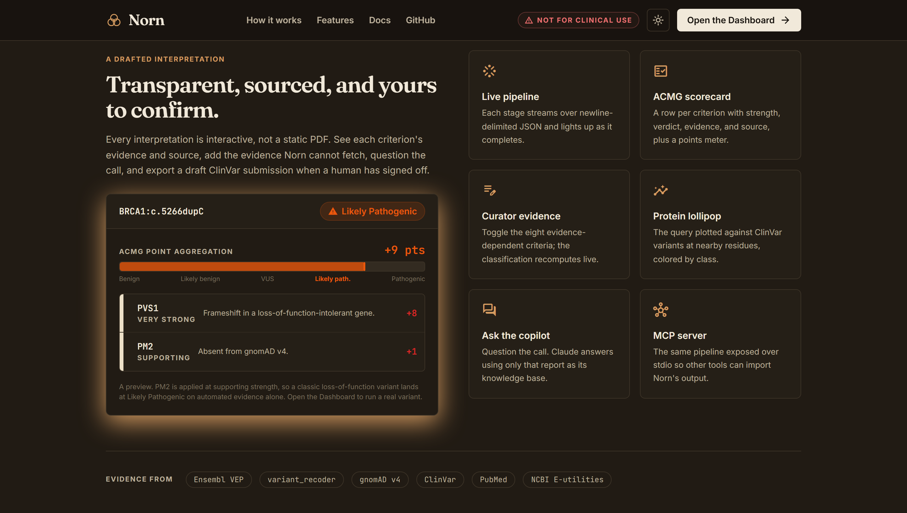
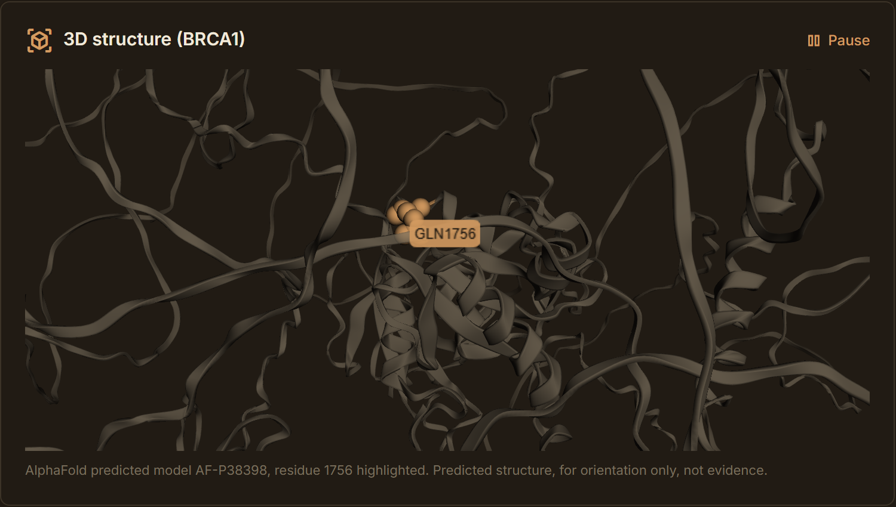

# Norn: Variant Interpretation Copilot

Norn is a variant-interpretation copilot that drafts ACMG/AMP evidence for a human curator to confirm. Paste one genetic variant (HGVS, rsID, or locus) and Norn gathers evidence from public genomics databases, adjudicates each ACMG/AMP criterion with Claude, applies the ClinGen points framework in code, and returns a scored classification with per-criterion sources and a reviewer checklist. The name is Norn, after the Norse fates who read and decree destiny from evidence; a variant classifier does the same, reading the evidence and rendering a verdict.

Vignesh Nagarajan was selected as 1 of 500 builders (about half of them PhDs, postdocs, or physicians) from more than 6,000 applicants across 47 countries for **Built with Claude: Life Sciences**, a global hackathon hosted by Anthropic and Cerebral Valley in partnership with Gladstone Institutes, and built Norn after being selected. Selectees received Claude Max and $200 in API credits to build with Claude Science and Claude Code.

- **Live demo:** [norn-five.vercel.app](https://norn-five.vercel.app/)
- **Hackathon:** [Built with Claude: Life Sciences](https://cerebralvalley.ai/e/built-with-claude-life-sciences)

<br>

<table>
  <tr>
    <td width="50%"></td>
    <td width="50%"></td>
  </tr>
  <tr>
    <td width="50%"></td>
    <td width="50%"></td>
  </tr>
  <tr>
    <td width="50%"></td>
    <td width="50%"></td>
  </tr>
</table>

## Tech stack

<p align="center"><b>Frontend</b></p>
<p align="center">
  
  
  
  
  
  
  
  
  
  
</p>

<p align="center"><b>Backend</b></p>
<p align="center">
  
  
  
  
</p>

<p align="center"><b>AI Reasoning</b></p>
<p align="center">
  
  
  
</p>

<p align="center"><b>Genomics Data</b></p>
<p align="center">
  
  
  
  
  
  
  
  
  
</p>

<p align="center"><b>Deployment &amp; Tooling</b></p>
<p align="center">
  
  
  
  
  
  
  
</p>

## Who it is for

The user is a molecular geneticist or genetic counselor doing variant curation. Concretely, picture a curator in a genomic-medicine group at Gladstone, for example the Conklin Lab at the Gladstone Institute of Data Science and Biotechnology, which builds iPSC disease models of inherited heart conditions. Before committing bench time to a candidate variant in a cardiomyopathy gene like MYH7 or TNNT2, they need a fast, sourced first pass on how the evidence lines up. Norn produces that draft in about a minute so the curator spends their time confirming and judging rather than gathering. Norn never replaces that person. It drafts; they decide.

## What it does, end to end

1. Normalizes the input with Ensembl variant_recoder.
2. Annotates it with Ensembl VEP: molecular consequence, transcript, protein change, and in-silico scores (AlphaMissense, SIFT, PolyPhen).
3. Reads population frequency from gnomAD v4.
4. Reads neighboring-residue evidence from ClinVar (for PS1 and PM5 only).
5. Computes objective signals and thresholds in code.
6. Asks Claude to adjudicate each of ten criteria (met, not met, or unknown) with one sentence of reasoning.
7. Combines the verdicts deterministically into a classification using the ClinGen points system.
8. Asks Claude to review the draft, flag conflicts or overcalls, and write the curator checklist.

The model justifies criteria. The engine combines them. The final label is always computed in code, never taken from the model. The full engine, thresholds, scoring, and the two Claude passes are documented in [docs/METHODOLOGY.md](docs/METHODOLOGY.md).


## Example variants

The home page includes one-click chips, each backed by a bundled fixture so the demo works even if a public API is briefly unavailable:

| Input | Variant | Norn result |
| --- | --- | --- |
| `BRCA1:c.5266dupC` | frameshift (5382insC) | Likely Pathogenic (PVS1) |
| `CFTR:c.1408A>G` | p.Met470Val, common | Benign (BA1 stand-alone override) |
| `BRCA1:c.5096G>A` | p.Arg1699Gln, reduced penetrance | Uncertain Significance |
| `MYH7:c.1208G>A` | p.Arg403Gln, hypertrophic cardiomyopathy | Uncertain Significance (curator adds PS3/PS4 to reach Pathogenic) |

Norn is deliberately conservative: it applies PM2 at supporting strength and leaves evidence-dependent criteria to the curator, so a classic loss-of-function variant lands at Likely Pathogenic rather than Pathogenic on the automated evidence alone. That is correct under current ClinGen guidance.

## Features

Every interpretation is interactive, not a static report:

- **Live pipeline view.** A progress bar and six stage beads (recode, VEP, gnomAD, ClinVar, adjudicate, review) fill as each stage streams over newline-delimited JSON.
- **ACMG scorecard and points meter.** A row per criterion with its strength, verdict, evidence, and source, plus a meter showing where the total lands on the Pathogenic-to-Benign scale.
- **Curator-supplied evidence.** Toggle the criteria that need functional, segregation, de novo, or phase evidence; the classification and points recompute live.
- **Protein lollipop and 3D structure.** The query plotted against ClinVar variants at nearby residues, and, where the gene maps to a UniProt entry, the residue highlighted on the AlphaFold model in the browser with 3Dmol.js (for orientation, not evidence).
- **Ask the copilot.** A chat panel where Claude answers using only that report as its knowledge base, explaining the call without inventing new evidence or a different label.
- **Literature.** A PubMed search for the gene and protein change surfaces functional and case evidence Norn does not read itself.
- **Batch mode.** Paste a list, upload a plain list, CSV, or VCF, or load a sample batch, and interpret many variants at once into a sortable worklist (`/batch`).
- **Evaluation with a Claude-vs-heuristic baseline.** The `/eval` page scores the pipeline against 20 well-established ClinVar variants and, on the same evidence, adjudicates with the deterministic heuristic alongside, so the lift from Claude's reasoning is measured rather than asserted.
- **Export.** Download a branded one-to-two-page PDF report (vector meter and lollipop, legible in light or dark mode), the full JSON, or a draft ClinVar submission row.
- **MCP server.** The same pipeline exposed over stdio (`interpret_variant`, `list_eval_variants`, `list_acmg_criteria`, `to_clinvar_submission`) so other tools can import Norn's output. See [docs/MCP.md](docs/MCP.md).
- **Themes and demo.** Dark by default with a one-toggle light theme, colorblind-safe and high-contrast palettes, and an inline screen recording of a real interpretation. In-app documentation lives at `/docs`. A light-mode screenshot is in [docs/DESIGN.md](docs/DESIGN.md).

## Run it and deploy it

Node 18.18 or newer, then `npm install` and `npm run dev` (the example chips work with no API key). Full local-setup steps, the scripts, the environment variables, and Vercel deployment are in **[docs/DEPLOYMENT.md](docs/DEPLOYMENT.md)**.

## Project layout

```
app/          Next.js App Router pages (/, /interpret, /batch, /eval, /docs) and API routes
components/   UI: pipeline view, scorecard, points meter, lollipop, curator panel, 3D structure
lib/          engine and clients (acmg, anthropic, ensembl, gnomad, clinvar, pipeline, fallback, ...)
data/         the 20-variant eval set and the gene-specific frequency thresholds
mcp/          the stdio MCP server
design/       brand kit: logo, illustrations, tokens, guide, deck template
docs/         methodology, deployment, design notes, MCP config, diagrams, screenshots, archived UI
public/       manifest, PWA icons, the demo video and poster, the deck (HTML + PDF)
```

The full directory map, conventions, and gotchas are in [CLAUDE.md](CLAUDE.md).

## Docs

Norn documents itself beyond this README:

| Doc | What's in it |
| --- | --- |
| [docs/DEPLOYMENT.md](docs/DEPLOYMENT.md) | Run it locally and deploy to Vercel: requirements, the scripts, the environment variables, and the deploy steps. |
| [docs/METHODOLOGY.md](docs/METHODOLOGY.md) | The ACMG engine in depth: criteria, thresholds, scoring, the two Claude passes, anti-circularity, evaluation, data sources, limitations, and references. |
| [docs/DESIGN.md](docs/DESIGN.md) | Design notes: the "loom of fate" identity, themes and palettes, the PDF and deck, the demo video. |
| [docs/MCP.md](docs/MCP.md) | The Model Context Protocol server: the tools it exposes and how to connect a client (for example Claude Desktop). |
| [CLAUDE.md](CLAUDE.md) | Contributor and AI-agent guide: architecture map, conventions, and gotchas. Read this first if you are working in the repo. |
| [design/README.md](design/README.md) | Brand kit guide: the logo, illustrations, tokens, and the deck template in `design/`. |
| [docs/archive/README.md](docs/archive/) | The previous "Scientific Precision" UI and diagrams, kept for reference. |

Plus in-app documentation at `/docs` covering the workflow, exports, and the MCP server.

## License

MIT. See [LICENSE](LICENSE).

> **Not for clinical use.** Norn is a research and demonstration tool. It drafts evidence for a human to confirm and is not a diagnostic device. Do not use it to make patient-care decisions.
