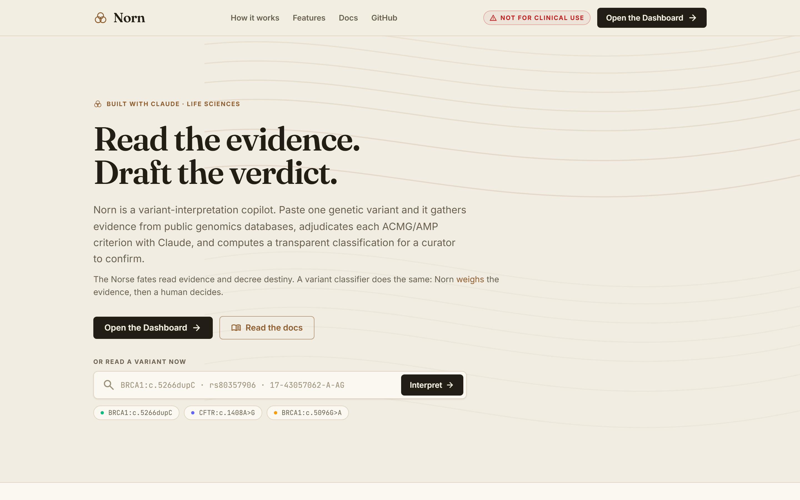
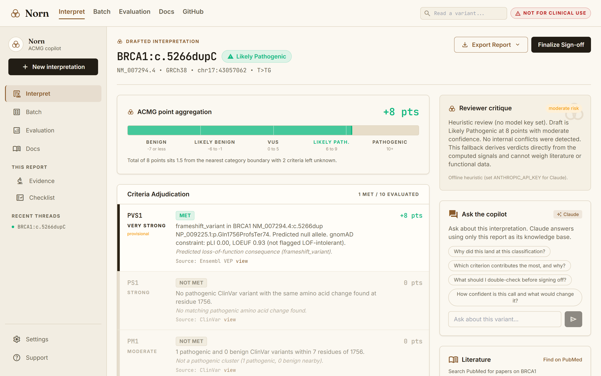
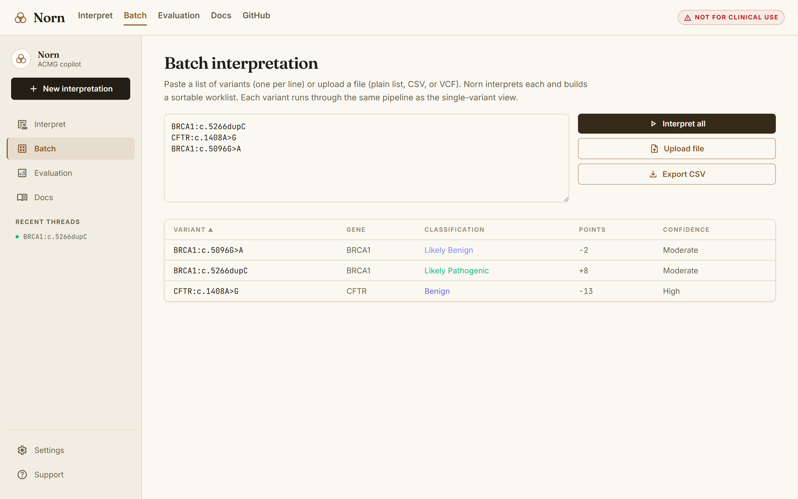
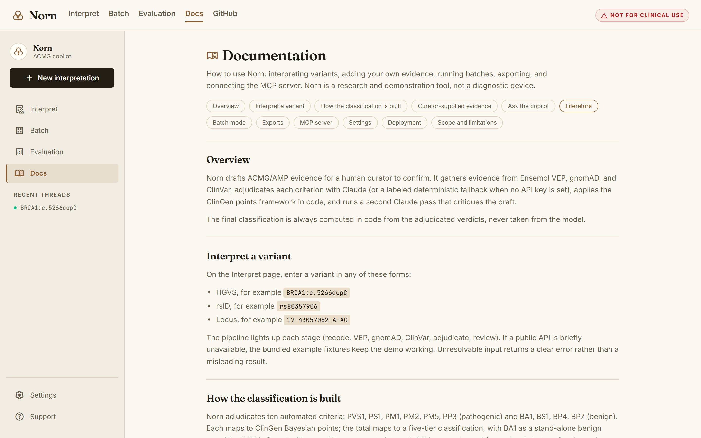
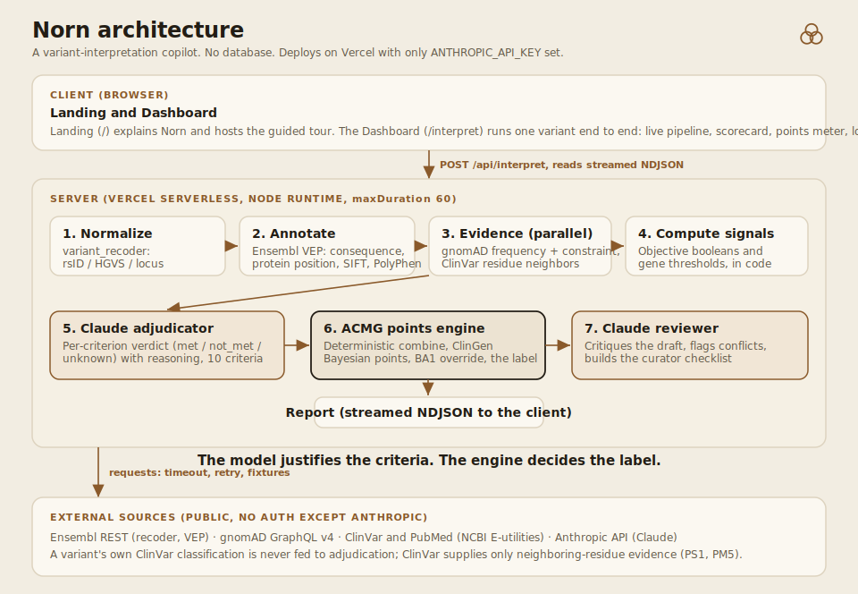
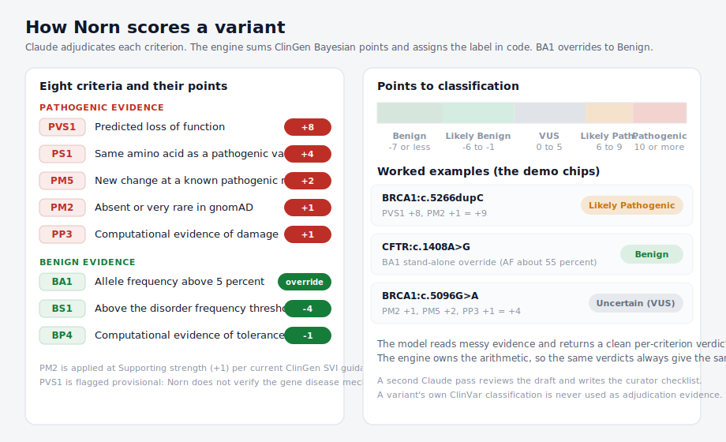

# Norn

Norn is a variant-interpretation copilot that drafts ACMG/AMP evidence for a human curator to confirm. Paste one genetic variant (HGVS, rsID, or locus) and Norn gathers evidence from public genomics databases, adjudicates each ACMG/AMP criterion with Claude, applies the ClinGen points framework in code, and returns a scored classification with per-criterion sources and a reviewer checklist. The name is Norn, after the Norse fates who read and decree destiny from evidence; a variant classifier does the same, reading the evidence and rendering a verdict.

Vignesh Nagarajan was selected as 1 of 500 builders (about half of them PhDs, postdocs, or physicians) from more than 6,000 applicants across 47 countries for **Built with Claude: Life Sciences**, a global hackathon hosted by Anthropic and Cerebral Valley in partnership with Gladstone Institutes, and built Norn after being selected. Selectees received Claude Max and $200 in API credits to build with Claude Science and Claude Code.

- **Live demo:** [norn-five.vercel.app](https://norn-five.vercel.app/)
- **Hackathon:** [Built with Claude: Life Sciences](https://cerebralvalley.ai/e/built-with-claude-life-sciences)

<p align="center">
  
  &nbsp;
  
</p>
<p align="center">
  
  &nbsp;
  
</p>

<p align="center"><sub>The screenshots from the earlier iteration are kept in <a href="docs/archive/">docs/archive/</a>.</sub></p>

## Tech stack

<p align="center"><b>Frontend</b></p>
<p align="center">
  
  
  
  
  
  
</p>

<p align="center"><b>Backend</b></p>
<p align="center">
  
  
  
  
</p>

<p align="center"><b>AI Reasoning</b></p>
<p align="center">
  
  
  
</p>

<p align="center"><b>Genomics Data</b></p>
<p align="center">
  
  
  
  
  
  
  
</p>

<p align="center"><b>Deployment &amp; Tooling</b></p>
<p align="center">
  
  
  
  
  
  
</p>

## Who it is for

The user is a molecular geneticist or genetic counselor doing variant curation. Concretely, picture a curator in a genomic-medicine group at Gladstone, for example the Conklin Lab at the Gladstone Institute of Data Science and Biotechnology, which builds iPSC disease models of inherited heart conditions. Before committing bench time to a candidate variant in a cardiomyopathy gene like MYH7 or TNNT2, they need a fast, sourced first pass on how the evidence lines up. Norn produces that draft in about a minute so the curator spends their time confirming and judging rather than gathering. Norn never replaces that person. It drafts; they decide.

## What it does, end to end

1. Normalizes the input with Ensembl variant_recoder.
2. Annotates it with Ensembl VEP: molecular consequence, transcript, protein change, SIFT and PolyPhen.
3. Reads population frequency from gnomAD v4.
4. Reads neighboring-residue evidence from ClinVar (for PS1 and PM5 only).
5. Computes objective signals and thresholds in code.
6. Asks Claude to adjudicate each of eight criteria (met, not met, or unknown) with one sentence of reasoning.
7. Combines the verdicts deterministically into a classification using the ClinGen points system.
8. Asks Claude to review the draft, flag conflicts or overcalls, and write the curator checklist.

The model justifies criteria. The engine combines them. The final label is always computed in code, never taken from the model.



## Example variants

The home page includes one-click chips, each backed by a bundled fixture so the demo works even if a public API is briefly unavailable:

| Input | Variant | Norn result |
| --- | --- | --- |
| `BRCA1:c.5266dupC` | frameshift (5382insC) | Likely Pathogenic (PVS1) |
| `CFTR:c.1408A>G` | p.Met470Val, common | Benign (BA1 stand-alone override) |
| `BRCA1:c.5096G>A` | p.Arg1699Gln, reduced penetrance | Uncertain Significance |

Norn is deliberately conservative. It applies PM2 at supporting strength and leaves evidence-dependent criteria to the curator, so a classic loss-of-function variant lands at Likely Pathogenic rather than Pathogenic on the automated evidence alone. That is the correct behavior under current ClinGen guidance, and it is stated plainly rather than inflated.

## The ACMG criteria Norn implements

Norn adjudicates ten criteria automatically and lets the curator supply the eight that depend on evidence it cannot fetch. Points follow the ClinGen Bayesian model (Tavtigian et al. 2018): Very Strong 8, Strong 4, Moderate 2, Supporting 1, benign criteria negative.

**Automated (adjudicated by Norn):**

| Code | Meaning | Strength (points) | Evidence source |
| --- | --- | --- | --- |
| PVS1 | Predicted loss of function (nonsense, frameshift, canonical splice) | Very Strong (+8) | Ensembl VEP, gnomAD constraint |
| PS1 | Same amino acid change as an established pathogenic variant | Strong (+4) | ClinVar |
| PM1 | Mutational hotspot or functional domain (local pathogenic cluster) | Moderate (+2) | ClinVar |
| PM2 | Absent or very rare in gnomAD | Moderate downgraded to Supporting (+1) | gnomAD v4 |
| PM5 | Different pathogenic missense at the same residue | Moderate (+2) | ClinVar |
| PP3 | Concordant computational evidence for damage | Supporting (+1) | VEP (SIFT, PolyPhen) |
| BA1 | Allele frequency above 5% | Stand-alone benign override | gnomAD v4 |
| BS1 | Frequency greater than expected for the disorder | Strong (-4) | gnomAD v4 |
| BP4 | Concordant computational evidence for tolerance | Supporting (-1) | VEP (SIFT, PolyPhen) |
| BP7 | Synonymous with no predicted splice impact | Supporting (-1) | Ensembl VEP |

**Curator-supplied (toggled in the report, classification recomputes live):** PS2, PS3, PS4, PM3, PM6, PP1 (pathogenic) and BS3, BS4 (benign). These need functional, segregation, de novo, or allelic-phase evidence that Norn does not fetch, so a human applies them.

Two caveats are surfaced in the report, not hidden:

- **PVS1 disease mechanism.** PVS1 also requires that loss of function is a known disease mechanism for the gene. Norn firms this with gnomAD gene constraint (pLI, LOEUF): a LOF-intolerant gene clears the provisional flag, otherwise PVS1 stays flagged for a human to confirm.
- **PM2 is applied at supporting strength (+1)**, following current ClinGen SVI guidance, even though its nominal ACMG strength is Moderate.

### Documented thresholds

Norn uses gene-specific allele-frequency thresholds where a rule is available (a small table inspired by ClinGen Variant Curation Expert Panels, in `data/gene-thresholds.json`), and generic defaults otherwise. The report shows which source was used.

- Generic defaults: BA1 above 0.05 (Richards et al. 2015), BS1 above 0.01, PM2 below 0.0001 or absent.
- Gene-specific example: BRCA1/BRCA2 use much stricter thresholds (illustrative ENIGMA-style values), so a low-frequency founder allele does not clear PM2.
- Computational concordance: PP3 when SIFT is deleterious and PolyPhen is probably damaging; BP4 when SIFT is tolerated and PolyPhen is benign. Modern practice uses calibrated meta-predictors; this two-tool concordance is a documented simplification.

The representative allele frequency is the larger of the global and popmax frequencies, which approximates a filtering allele frequency for this demo.

### Points to classification

The point total maps to a five-tier classification (Tavtigian et al. 2020; ClinGen SVI):

| Total points | Classification |
| --- | --- |
| 10 or more | Pathogenic |
| 6 to 9 | Likely Pathogenic |
| 0 to 5 | Uncertain Significance |
| -6 to -1 | Likely Benign |
| -7 or less | Benign |

BA1 (allele frequency above 5%) is a stand-alone override to Benign regardless of the point total. Confidence (High, Moderate, Low) is derived from how far the total sits from the nearest category boundary and how many criteria were left unknown. The exact logic is in [`lib/acmg.ts`](lib/acmg.ts).

## How the scoring works



## In the app

Every interpretation is interactive, not a static report:

- **Landing and Dashboard.** A dynamic landing page (`/`) explains what Norn does, frames the pipeline as the three Norse fates (gather, weigh, decree), and links straight into the Dashboard (`/interpret`), the working surface where every feature below lives.
- **Live pipeline view.** Each stage (recode, VEP, gnomAD, ClinVar, adjudicate, review) lights up as it completes, streamed over newline-delimited JSON.
- **ACMG scorecard and points meter.** A row per criterion with its strength, verdict, evidence, and source, plus a meter showing where the total lands on the Pathogenic-to-Benign scale.
- **Curator-supplied evidence.** Toggle the criteria that need functional, segregation, de novo, or phase evidence; the classification and points recompute live.
- **Protein lollipop.** The query variant plotted against ClinVar variants at nearby residues, colored by classification.
- **Ask the copilot.** A chat panel where the curator can question the interpretation. Claude answers using only that report as its knowledge base, so it explains the call without inventing new evidence or a different label.
- **Literature.** Search PubMed for the gene and protein change to surface functional and case evidence Norn does not read itself.
- **Batch mode.** Paste a list or upload a plain list, CSV, or VCF and interpret many variants into a sortable worklist (`/batch`).
- **Export.** Download a formatted PDF (with the points meter and lollipop drawn as vector graphics), the full JSON, or a draft ClinVar submission row.
- **History.** Recent interpretations are kept in the browser and listed in the sidebar.
- **Settings.** Switch between the design-system colors (pathogenic teal) and the clinical convention (pathogenic red), and toggle the per-criterion model reasoning. Preferences persist in the browser.
- **Sign-off.** A curator can mark a draft as reviewed. Norn records the intent; it never signs off on its own.
- **Docs.** An in-app documentation page (`/docs`) covers the workflow, exports, and the MCP server.

## The Claude reasoning layer

Two server-side Anthropic calls run per variant. The API key never reaches the client.

1. **Adjudicator.** Receives the gathered evidence plus the code-computed signals and returns strict JSON with a verdict, evidence, source, and one-sentence reasoning per criterion. The response is parsed defensively and validated against a Zod schema, with one reformat retry.
2. **Reviewer.** Receives the draft classification and evidence, critiques it, catches overcalls and internal conflicts (for example a benign and a pathogenic computational criterion both marked met), and writes the "curator should double-check" checklist. This mirrors the reviewer-agent pattern in Claude Science.

If no `ANTHROPIC_API_KEY` is set, or a model call fails, Norn falls back to a deterministic heuristic that derives verdicts directly from the computed signals. The fallback is labeled clearly in the UI as an offline heuristic and is never presented as model reasoning. Norn also flags any case where a model verdict disagrees with a hard code-computed signal.

Model selection: read from `ANTHROPIC_MODEL`, default `claude-opus-4-8`. `claude-sonnet-5` is a faster, cheaper alternative for the same pipeline.

## Anti-circularity

A variant's own ClinVar classification is never fed into adjudication. ClinVar is used only for two things: neighboring-residue evidence for PS1 and PM5, and the ground-truth labels in the eval set. This keeps the adjudication from simply echoing an existing ClinVar call.

## Model Context Protocol server

Norn ships an MCP server ([`mcp/server.ts`](mcp/server.ts)) so other tools can import its data directly. It exposes `interpret_variant`, `list_eval_variants`, `list_acmg_criteria`, and `to_clinvar_submission` over stdio, using the same pipeline as the web app. Run it with `npm run mcp` and connect any MCP client (for example Claude Desktop). See [docs/MCP.md](docs/MCP.md) for the config.

## Evaluation

`data/eval-variants.json` holds 20 well-established variants across BRCA1, BRCA2, CFTR, HBB, TP53, MLH1, HFE, MSH6, and APC, spanning pathogenic, benign, and uncertain, each with its generally accepted ClinVar germline classification and accession.

The `/eval` page runs the full Norn pipeline on each variant and reports two numbers:

- **Exact agreement**: the five-tier classification matches the expected label.
- **Directional concordance**: the call lands in the same direction (pathogenic-leaning, uncertain, or benign-leaning).

Because Norn applies PM2 at supporting strength and implements only eight criteria, exact agreement is lower than directional concordance, which is the more meaningful measure for a triage copilot. Disagreements are shown, not hidden. The eval never feeds a variant's own ClinVar classification into the engine; the expected label is only the comparison target.

## Data sources

- **Ensembl VEP and variant_recoder** (REST): molecular consequence, transcript, protein change, in-silico scores, and input normalization. https://rest.ensembl.org
- **gnomAD v4** (GraphQL): population allele frequency. https://gnomad.broadinstitute.org
- **ClinVar** (NCBI E-utilities): neighboring-residue evidence and eval ground truth. https://www.ncbi.nlm.nih.gov/clinvar/

Every external call has a timeout, one retry, and graceful degradation. If a source is unavailable, the affected criteria are marked unknown rather than failing the whole request. In-memory caching keeps repeated lookups within a warm serverless instance cheap.

## Run it locally

Requirements: Node 18.18 or newer.

```bash
git clone https://github.com/vignesh-nagarajan-vn/Norn.git
cd Norn
npm install
cp .env.example .env.local   # add your ANTHROPIC_API_KEY
npm run dev
```

Open http://localhost:3000. The example chips work without any keys (they use bundled fixtures and the deterministic fallback). Setting `ANTHROPIC_API_KEY` switches the two reasoning passes to real Claude calls.

Build and type-check:

```bash
npm run build
npm run typecheck
```

Run the MCP server (exposes Norn to other MCP clients):

```bash
npm run mcp
```

## Deploy on Vercel

Norn deploys on Vercel with no extra infrastructure. There is no database.

1. Import the repository into Vercel (framework preset: Next.js).
2. Set `ANTHROPIC_API_KEY`. Optionally set `ANTHROPIC_MODEL` and `NCBI_API_KEY`.
3. Deploy.

The heavy route (`/api/interpret`) sets `maxDuration = 60` and streams progress as newline-delimited JSON.

### Environment variables

| Name | Required | Purpose |
| --- | --- | --- |
| `ANTHROPIC_API_KEY` | Yes, for real model passes | Enables the Claude adjudicator and reviewer. Without it, Norn uses the labeled deterministic fallback. |
| `ANTHROPIC_MODEL` | No | Model id. Defaults to `claude-opus-4-8`. `claude-sonnet-5` is a faster, cheaper option. |
| `NCBI_API_KEY` | No | Raises NCBI E-utilities rate limits from 3 to 10 requests per second. |

## Project layout

```
app/                 Next.js App Router pages and API routes
  page.tsx           landing page (what Norn does, links into the Dashboard)
  interpret/         the Dashboard: single-variant pipeline and report
  batch/             batch worklist
  eval/              eval runner page
  docs/              in-app documentation
  icon.svg           the Norn mark (favicon)
  api/interpret/     streaming pipeline route (NDJSON)
  api/eval/          serves the static eval dataset
components/           UI: pipeline view, scorecard, points meter, lollipop, curator panel
lib/                  engine and clients
  acmg.ts            criteria specs, points, classification thresholds
  anthropic.ts       the two Claude passes
  ensembl.ts         variant_recoder and VEP
  gnomad.ts          gnomAD GraphQL
  clinvar.ts         ClinVar E-utilities
  pipeline.ts        orchestrator with streamed stages
  fallback.ts        deterministic heuristic when no key is set
  fixtures.ts        offline demo data for the example chips
data/eval-variants.json   the 20-variant evaluation set
docs/                architecture and scoring diagrams, design notes
```

## Scope and limitations

- Norn implements 8 of the 28 ACMG/AMP criteria. It does not use segregation, functional studies, de novo status, allelic data, or literature curation.
- PVS1 does not verify that loss of function is a disease mechanism for the gene. It is flagged provisional.
- Frequency thresholds are generic defaults, not gene- and disease-specific.
- Computational evidence uses SIFT and PolyPhen concordance, not calibrated meta-predictors.
- The gnomAD variant lookup for complex indels can miss if coordinate normalization does not match gnomAD's minimal representation. The affected criteria degrade to unknown.
- The protein lollipop shows a sample of ClinVar variants for the gene and is best-effort. It falls back cleanly when protein positions are unavailable.
- Norn is not a diagnostic device and must not be used for clinical decisions.

## Roadmap

Delivered in the current build:

- **More ACMG criteria.** Ten criteria are adjudicated automatically (adding PM1 hotspot clustering and BP7 synonymous), and PS2, PS3, PS4, PM3, PM6, PP1, BS3, and BS4 are curator-supplied with live recompute.
- **Firmed PVS1.** gnomAD gene constraint (pLI, LOEUF) clears the provisional flag for loss-of-function-intolerant genes.
- **Gene-specific thresholds.** A gene-threshold table (illustrative VCEP-style values) replaces the generic defaults where available.
- **Batch mode.** Paste a list or upload a plain list, CSV, or VCF and interpret many variants into a sortable worklist.
- **Persistence.** Recent interpretations are kept in the browser and listed in the sidebar.
- **Write-back.** A draft ClinVar submission row is available as a CSV export and as the `to_clinvar_submission` MCP tool.
- **Literature mining.** A PubMed search surfaces functional and case evidence for the gene and protein change.

Still ahead:

- **Calibrated predictors.** Replace SIFT and PolyPhen concordance for PP3 and BP4 with calibrated meta-predictors (REVEL, AlphaMissense, BayesDel) at published thresholds.
- **Audit trail.** A server-side store of interpretations and sign-off history so a lab can track who reviewed what and when.
- **Confidence calibration.** Score Norn against a larger labeled set and report calibrated confidence per classification.

Presentation and craft (how Norn is built and shown, not the product itself):

- **A complete identity kit.** Grow the "loom of fate" system past the app chrome: a full favicon and app-icon set (seeded in `app/icon.svg`), an Open Graph social-preview card so shared links unfurl with the Norn mark, and a small set of hand-drawn thread and rune illustrations, so the identity carries into link previews and slides, not only the pages.
- **A guided demo mode.** A first-run tour that auto-plays one interpretation and annotates each fate step (gather, weigh, decree), so a judge or new visitor understands the pipeline in about thirty seconds without typing a variant.
- **A living style guide with visual-regression snapshots.** A `/style` page documenting the design tokens, the loom motif, and the criterion and verdict components, backed by the Playwright screenshot pass in CI so a future redesign cannot silently regress the four views in this README.

## References

- Richards S, et al. Standards and guidelines for the interpretation of sequence variants: a joint consensus recommendation of the ACMG and AMP. Genet Med. 2015. (ACMG/AMP criteria)
- Tavtigian SV, et al. Modeling the ACMG/AMP variant classification guidelines as a Bayesian classification framework. Genet Med. 2018. (points framework)
- Tavtigian SV, et al. Fitting a naturally scaled point system to the ACMG/AMP variant classification guidelines. Hum Mutat. 2020. (point thresholds)
- ClinGen Sequence Variant Interpretation working group recommendations (PM2 supporting, calibrated criteria).
- Karczewski KJ, et al. gnomAD. (population frequency, v4)
- Landrum MJ, et al. ClinVar. (variant classifications)
- McLaren W, et al. The Ensembl Variant Effect Predictor. Genome Biol. 2016.

## License

MIT. See [LICENSE](LICENSE).

> **Not for clinical use.** Norn is a research and demonstration tool. It drafts evidence for a human to confirm and is not a diagnostic device. Do not use it to make patient-care decisions.
