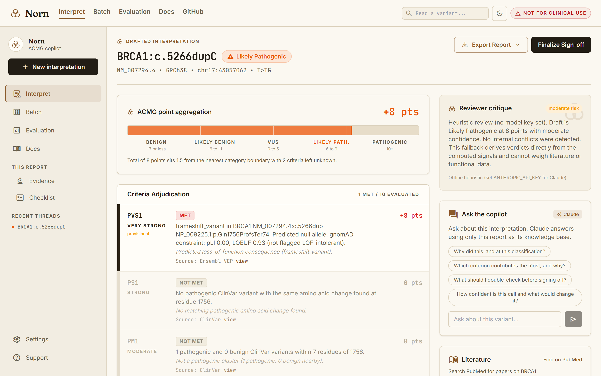

# Design notes

This records the decisions behind Norn that are not obvious from the code.

## Visual identity: the loom of fate

Norn is named for the Norse fates who read evidence and decree destiny. The UI leans into that without becoming fantasy: a warm vellum canvas with deep ink text, the Fraunces serif for display headings, JetBrains Mono for variant and data strings, and a single bronze "thread of fate" accent for interactive chrome. The mark is three interlocked rings, the three fates bound together (`components/ui.tsx` `NornMark`, and `app/icon.svg` as the favicon). Tokens are defined once in `app/globals.css` as a hex form and a channel (`-rgb`) form so Tailwind opacity modifiers work.

The classification colors are engine-contract tokens, read at runtime, so retuning the chrome never reached into `lib/acmg.ts`, the PDF export, or the eval. The default palette is the clinical convention (pathogenic red, VUS amber, benign green); Settings also offers a colorblind-safe scheme (Okabe-Ito: vermillion, amber, blue) and a high-contrast scheme for projectors and print. The pipeline is drawn as beads on a thread with a bronze loading bar that weaves (a shimmering sheen) as the streamed stages complete, and the points meter as a scale, but the math behind both is unchanged. The previous "Scientific Precision" UI (a flat Google Stitch mockup) is archived in `docs/archive/`.

Where a variant maps to a protein structure, the report also shows it in 3D: the AlphaFold model rendered in the browser with 3Dmol.js, the affected residue highlighted in the bronze accent (`components/Structure3D.tsx`). It is explicitly labeled for orientation, not evidence, and hides itself when the gene is unmapped or the structure cannot be reached.

## The demo video and the identity kit

The demo is a roughly 30-second screen recording of the real app (`public/norn-demo.webm`), not a canned animation. It plays inline on the landing's "See it in motion" band and expands to a full-screen player (`VideoLightbox` in `app/page.tsx`) from the "Watch" buttons or `?demo=1`. It is recorded in light mode and kept that way even though the app defaults to dark, so the recording reads clearly in the lightbox and in link previews. The recording is driven by Playwright with a drawn cursor and a mocked `/api/interpret`, so there is no loading wait on screen. The brand kit (logo variants, thread and rune illustrations, tokens, and a guide) lives in `design/`; the favicon, Open Graph and Twitter cards, apple icon, and maskable PWA icons are generated from the same tokens and committed under `app/` and `public/`. The point is that the identity holds up outside the app: in a browser tab, a shared link, and a slide.

## Dark mode reverses the chrome, not the meaning

The theme (`data-theme`, dark or light) is independent of the classification scheme, and dark is the default (a pre-paint script in `app/layout.tsx` applies the saved theme with no flash). Dark mode overrides only the chrome tokens: a warm near-black "night vellum" canvas, light paper text, a lighter bronze so the mark reads as the reverse lockup, an inverted primary button, and a light sepia ACMG strength ramp. The two deepest classification tiers (strong pathogenic, strong benign) are lifted per scheme so a Pathogenic or Benign label stays legible on the dark canvas. Everything else, including the whole engine and the PDF, is untouched.

  

Dark is the default; a light theme is one toggle away. Classification colors follow the chosen palette.

## The printout and the deck

A lab hands around paper and slides, so the identity has to survive leaving the browser. The PDF export (`lib/pdf.ts`) is the one-page-or-two interpretation printout: the Norn mark drawn as vector rings, a header and a footer on every page, a solid classification chip, the points meter and lollipop as vectors, and a "Not for clinical use" line on every page. Its chrome is fixed to a light print palette (ink, bronze, greys) so it looks the same whether the app is in light or dark mode; only the classification colors follow the chosen scheme. `design/slides/deck.html` is a matching, self-contained slide template (Fraunces, vellum, the mark, the three fates, a sample result) that prints to a landscape PDF. It is also embedded as a PDF slideshow in the in-app Docs tab (`public/norn-deck.pdf`, printed from `public/deck.html`). Both reuse the tokens in `design/`. The architecture and scoring diagrams (`docs/architecture.svg`, `docs/scoring-model.svg`) were restyled to the same identity with updated numbers, and the previous blue versions are kept in `docs/archive/`.

## Landing separate from the Dashboard

`/` is a landing page that explains what Norn does and frames the pipeline as the three fates (Urðr, gather; Verðandi, weigh; Skuld, decree). The working app lives at `/interpret`, reached by the landing's "Open the Dashboard" button and by its variant search, which deep-links to `/interpret?v=...`. The sidebar Recent links and the batch and eval variant links point at `/interpret?v=...` as well. Splitting the two lets the landing sell the idea while the Dashboard stays a focused workspace.

## Named user first

Norn is scoped to one person: a molecular geneticist or genetic counselor doing variant curation. Every screen answers a question that person actually asks (what is the consequence, how rare is it, what do neighbors look like, what does the evidence add up to, what should I check). Features that did not serve that user were left out.

## The model justifies, the engine decides

The final classification is computed in code from the adjudicated verdicts. The model is never asked for the label. This keeps the output reproducible and auditable: given the same verdicts, the classification and points are always the same. The model's job is to read messy evidence and return a clean per-criterion verdict with reasoning, which is what language models are good at. The combining rules are arithmetic, which code should own.

To make the model's verdicts trustworthy, Norn first computes objective signals in code (frequency against thresholds using gnomAD's faf95 filtering AF, the calibrated AlphaMissense score for PP3/BP4, loss-of-function consequence, ClinVar neighbor presence) and passes them to the adjudicator as strong priors. Norn then compares the model's verdict to the signal and flags any disagreement, so a model that drifts from the data is caught rather than trusted blindly.

## Anti-circularity

A variant's own ClinVar classification is deliberately excluded from adjudication. If Norn fed a variant's ClinVar call into the evidence, the whole exercise would collapse into echoing ClinVar. ClinVar is used only for neighboring-residue evidence (PS1 and PM5, which are about other variants at the same position) and as the ground-truth label in the eval set. The eval enforces the same exclusion so the agreement numbers are not circular.

## PVS1 is provisional on purpose

PVS1 in the ACMG guideline requires both a predicted null variant and that loss of function is an established disease mechanism for the gene. Norn detects the first from VEP but cannot verify the second without a curated gene-mechanism resource. Rather than quietly assume it, Norn applies PVS1 for the consequence, marks it provisional in the scorecard, and makes the reviewer checklist always ask a human to confirm the mechanism when PVS1 is met. This is the honest version of a hard criterion.

## PM2 at supporting strength

PM2 is nominally Moderate (+2) in ACMG 2015, but the ClinGen Sequence Variant Interpretation working group recommends applying it at Supporting strength. Norn follows the current guidance and assigns +1. A direct consequence is that a single loss-of-function variant that is also rare totals +9 (PVS1 +8, PM2 +1), which is Likely Pathogenic rather than Pathogenic. This is correct under the point system, and it is documented in the UI and README so it does not read as a bug.

## Points system over the decision-tree combining rules

Norn uses the Tavtigian point system rather than the original combining-rule table because points compose cleanly, are easy to display on a single meter, and make the distance to a category boundary meaningful for a confidence estimate. Thresholds: Pathogenic 10 or more, Likely Pathogenic 6 to 9, Uncertain 0 to 5, Likely Benign -6 to -1, Benign -7 or less. BA1 overrides to Benign.

## Streaming pipeline for a legible demo

The interpret route streams newline-delimited JSON, one event per stage, then a final result object. The client lights up each stage as it completes. This makes the evidence-gathering visible instead of a spinner, which matters for a tool whose value is transparency. Streaming also fits the serverless model: the function runs to completion within `maxDuration = 60` and the client reads the body as it arrives.

## gnomAD lookup by rsID first

gnomAD's GraphQL `variant` field accepts an rsID directly. Looking up by rsID is more reliable than building a chrom-pos-ref-alt id, especially for indels where minimal-representation normalization is easy to get wrong. Norn prefers the rsID (from variant_recoder) and falls back to a constructed variant id. A genuine "not found" from gnomAD is treated as absent (which supports PM2); a network or lookup error is treated as unknown, so a failed lookup never masquerades as a rare-variant signal.

## Resilient demo path

The three example chips are backed by bundled fixtures. Norn always tries the live public APIs first. If annotation fails (for example Ensembl is briefly unreachable), the pipeline falls back to the fixture for that variant and uses the fixture's frequency and ClinVar data together, so the report stays internally consistent rather than mixing fixture annotation with live lookups on mismatched coordinates. Reports built with fixture data are marked as such. This guarantees the demo produces a complete report on stage while keeping live data as the default.

## Eval is client-orchestrated

The eval page runs each variant through the same `/api/interpret` route, one request per variant with a small concurrency pool, and aggregates on the client. This keeps every serverless invocation inside the 60-second limit instead of trying to run 20 variants in one function call, and it lets the table and running agreement fill in live.

## No database

Everything is either computed on request or read from a static JSON file in the repo. Caching is in-memory per warm instance. This meets the goal of deploying on Vercel with only `ANTHROPIC_API_KEY` set and nothing else to provision.
