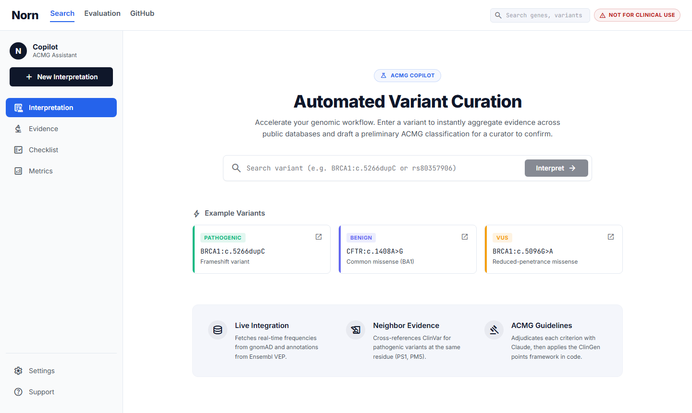
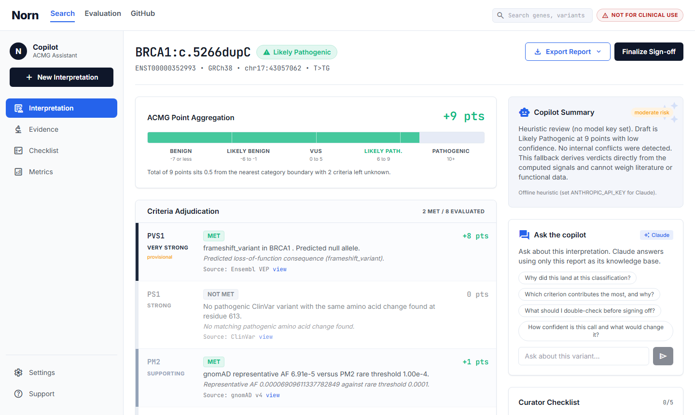

# Archived UI (previous iteration)

These screenshots and diagrams are from Norn's first UI, the "Scientific Precision" build generated from a Google Stitch mockup (flat white, blue accent, sans-serif throughout). They are kept for reference only and do not reflect the current app.

| File | Was |
| --- | --- |
| `ui-home-v1.png` | the old home / search page |
| `ui-dashboard-v1.png` | the old interpretation dashboard |
| `architecture-v1.svg` | the old architecture diagram (blue/indigo) |
| `scoring-model-v1.svg` | the old scoring diagram (blue/indigo) |

The current `docs/architecture.svg` and `docs/scoring-model.svg` are restyled to the loom identity (vellum, ink, bronze, the mark) with updated info (ten automated criteria).

  
  &nbsp;
  

The current UI is the "loom of fate" redesign: a warm vellum canvas, deep ink text, the Fraunces serif for display, a bronze thread accent, and a woven-knot Norn mark. See the screenshots at the top of the main [README](../../README.md) and the design notes in [DESIGN.md](../DESIGN.md).
